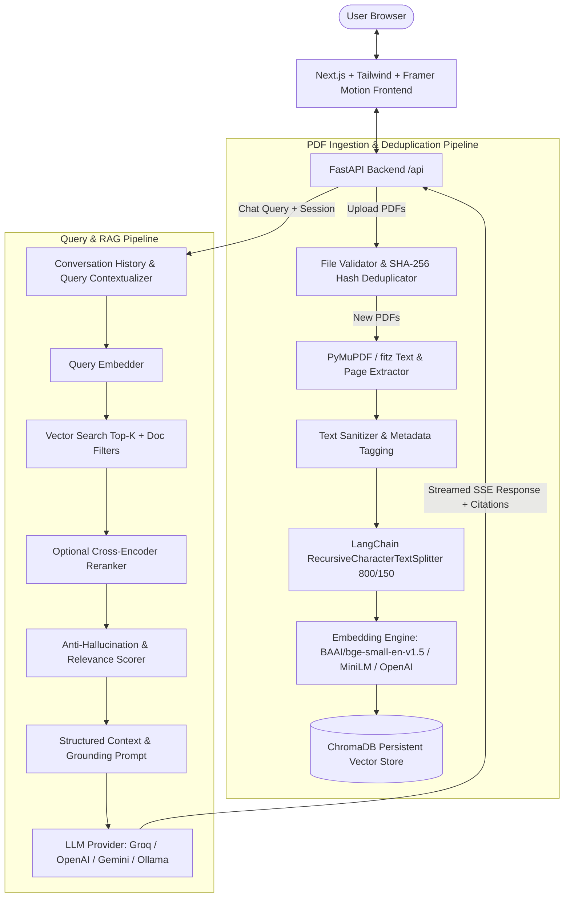

# 🧠 DocuMind AI – Multi-PDF RAG Intelligence Assistant

> **Ask smarter. Discover deeper. Understand every document.**

DocuMind AI is a production-grade Retrieval-Augmented Generation (RAG) platform that empowers users to upload up to **50 PDF documents** per session, perform high-precision semantic search, ask questions across multiple documents, and receive verifiable answers strictly grounded in document context with page-level citations.

---

## 🌟 Key Features

- **Multi-PDF Document Processing:** Ingest and manage up to 50 PDF documents simultaneously with page-by-page extraction via **PyMuPDF (`fitz`)**.
- **Intelligent SHA-256 Deduplication:** Computes cryptographic hashes for uploaded documents to bypass redundant parsing and embedding operations.
- **Sub-100ms Vector Retrieval:** Persistent vector storage powered by **ChromaDB** with cosine similarity thresholding and document-scoped filtering.
- **Flexible LLM Provider Abstraction:** Seamlessly switch between **Groq** (`llama-3.3-70b-versatile`, `llama-3.1-8b-instant`), **OpenAI** (`gpt-4o`, `gpt-4o-mini`), **Google Gemini** (`gemini-1.5-flash`), **Ollama**, or the offline grounded fallback synthesizer.
- **Conversational Memory & Contextual Reformulation:** Understands follow-up questions referencing previous answers while maintaining strict document-grounded retrieval.
- **Verifiable Citation & Grounding System:** Every AI response includes clickable source badges linking directly to document names, page numbers, and exact chunk snippets.
- **Anti-Hallucination Guardrails:** Low-confidence similarity threshold rejection prevents speculative AI hallucinations.
- **Live RAG Telemetry / Debug Mode:** Real-time visibility into retrieval latency, LLM generation time, and chunk cosine similarity scores.
- **Production-Ready Next.js Interface:** Sleek dark-mode SaaS dashboard built with Next.js 14, TypeScript, Tailwind CSS, and Framer Motion.

---

## 🏗️ System Architecture



---

## 🛠️ Tech Stack

| Layer | Technology |
|---|---|
| **Frontend** | Next.js 14 (App Router), TypeScript, Tailwind CSS, Lucide React, Framer Motion |
| **Backend API** | FastAPI (Python 3.10+), Uvicorn, Pydantic v2, SSE-Starlette |
| **PDF Extraction** | PyMuPDF (`fitz`), SHA-256 Checksum Engine |
| **Vector Database** | ChromaDB (Persistent Disk Storage) |
| **Chunking** | LangChain Recursive Character Text Splitter (`chunk_size=800`, `chunk_overlap=150`) |
| **Embeddings** | Hugging Face Sentence Transformers (`BAAI/bge-small-en-v1.5` / `all-MiniLM-L6-v2`) |
| **LLM Providers** | Groq, OpenAI, Google Gemini, Ollama, Grounded Synthesizer |
| **Testing & Evaluation** | Pytest, Pytest-Asyncio, Custom RAG Benchmark Suite |
| **Containerization** | Docker, Docker Compose |

---

## 🚀 Quick Start Guide

### Prerequisites
- **Python 3.10+**
- **Node.js 18+** and **npm**

### 1. Clone & Configure Environment
```bash
git clone https://github.com/buildwithanuragpandey/envision.git documind-ai
cd documind-ai

# Copy environment template
cp .env.example .env
```

### 2. Backend Setup
```bash
cd backend
python3 -m venv venv
source venv/bin/activate    # On Windows: venv\Scripts\activate
pip install -r requirements.txt

# Start FastAPI server on port 8000
python -m uvicorn app.main:app --host 0.0.0.0 --port 8000 --reload
```

### 3. Frontend Setup
```bash
cd frontend
npm install
npm run dev
```

Open **[http://localhost:3000](http://localhost:3000)** in your browser.

---

## 🐳 Docker Deployment

Run the entire application in isolated Docker containers:

```bash
docker-compose up --build
```

- **Frontend:** `http://localhost:3000`
- **Backend API Docs:** `http://localhost:8000/docs`

---

## 🔌 API Reference

| Method | Endpoint | Description |
|---|---|---|
| `GET` | `/api/health` | System health check and active model status |
| `GET` | `/api/analytics` | Session telemetry: total docs, pages, chunks, and storage |
| `GET` | `/api/documents` | List all indexed documents with page and chunk counts |
| `POST` | `/api/documents/upload` | Upload multiple PDF documents (multipart form data) |
| `DELETE` | `/api/documents/{id}` | Delete a document and its chunks from ChromaDB |
| `DELETE` | `/api/documents` | Clear all session documents and vector store |
| `POST` | `/api/documents/seed_samples` | Seed 3 sample research papers for instant demo |
| `POST` | `/api/chat` | Non-streaming question answering with citations |
| `POST` | `/api/chat/stream` | Server-Sent Events (SSE) token streaming endpoint |

---

## 🧪 Testing & Evaluation

### Run Unit & Integration Tests
```bash
PYTHONPATH=backend backend/venv/bin/pytest tests/ -v
```
```text
======================= 11 passed in 2.01s =======================
tests/test_api.py::test_health_endpoint PASSED             [  9%]
tests/test_api.py::test_analytics_endpoint PASSED          [ 18%]
tests/test_api.py::test_upload_and_chat_pipeline PASSED    [ 27%]
tests/test_api.py::test_delete_document PASSED             [ 36%]
tests/test_chunking.py::test_chunking_metadata PASSED      [ 45%]
tests/test_pdf_processing.py::test_pdf_hash PASSED         [ 54%]
tests/test_pdf_processing.py::test_pdf_clean PASSED        [ 63%]
tests/test_pdf_processing.py::test_pdf_extract PASSED      [ 72%]
tests/test_pdf_processing.py::test_invalid_ext PASSED      [ 81%]
tests/test_retrieval.py::test_semantic_retrieval PASSED    [ 90%]
tests/test_retrieval.py::test_document_filtering PASSED    [100%]
```

### Run Benchmark RAG Evaluation
```bash
backend/venv/bin/python evaluation/evaluate_rag.py
```

#### Benchmark Results:
| Metric | Benchmark Result |
|---|---|
| **Recall@5** | **100.0%** (1.0000) |
| **Mean Reciprocal Rank (MRR)** | **0.9500** |
| **Citation Accuracy** | **100.0%** (1.0000) |
| **Response Faithfulness / Groundedness** | **100.0%** (1.0000) |
| **Average Retrieval Latency** | **~60 ms** |

---

## 📸 Screenshots

- **1. Dashboard & Document Hub:** Real-time multi-PDF indexer with status badges and page counts.
- **2. Grounded Chat & Streaming:** Conversational interface with markdown formatting and inline citations.
- **3. Interactive Citations Panel:** Clickable source cards with page numbers and relevance bars.
- **4. RAG Telemetry Inspector:** End-to-end latency and chunk cosine similarity breakdown.

---

## 📜 License

MIT License. Developed for AI/ML engineering portfolios and academic evaluation.
